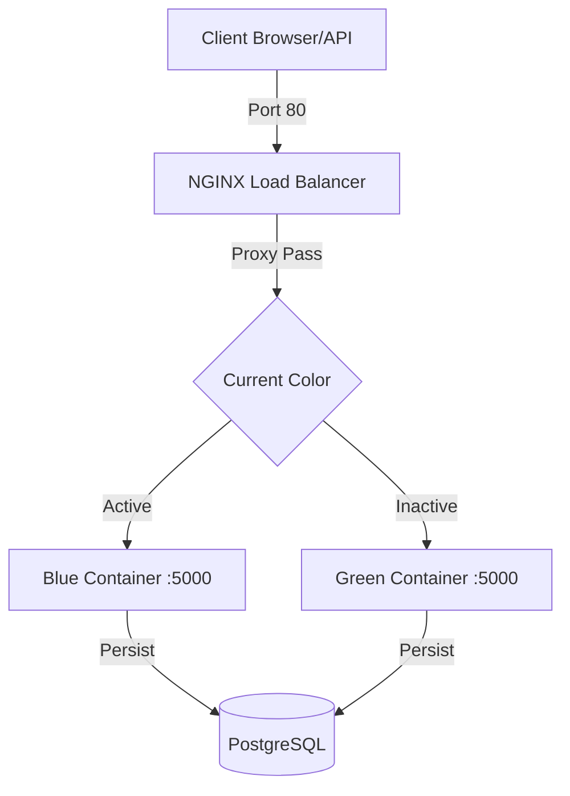

# Zero-Downtime Blue-Green Deployment System

This project demonstrates a production-grade Blue-Green deployment strategy using **Docker Compose** and **NGINX**.

## System Architecture



- **Database**: PostgreSQL container stores application state (`visit_count`). Data persists even when switching application versions.
- **CI/CD**: GitHub Actions workflow (`.github/workflows/main.yml`) automatically tests and builds the application on every push.

## Prerequisites
- **NGINX**: Acts as the reverse proxy. It routes traffic to the *active* color based on `nginx/conf.d/upstream.conf`.
- **Zero Downtime**: The `deploy.sh` script validates the new container's health *before* switching traffic. NGINX reloads configuration gracefully without dropping connections.

## Prerequisites

- Docker
- Docker Compose
- Unix-like environment (Debian/Ubuntu/Codespaces)

## Setup

1. **Initialize Environment**:
   If running in a fresh Codespace, run the setup script:
   ```bash
   chmod +x scripts/setup_env.sh
   ./scripts/setup_env.sh
   # Reload shell if group permissions changed
   ```

2. **Start the System**:
   ```bash
   docker-compose up -d
   ```
   This starts Blue, Green, and Nginx. Default is **Blue**.

   Verify with:
   ```bash
   curl localhost
   # Output: {"color":"blue","message":"...","version":"1.0"}
   ```

## Usage

### Deploying a New Version
The `deploy.sh` script automates the process:
1. Detects current active color (e.g., Blue).
2. Deploys/Restarts the *other* color (Green).
3. Waits for health check (`/health`) to return 200 OK.
4. Updates NGINX config to point to Green.
5. Reloads NGINX.

```bash
chmod +x scripts/deploy.sh
./scripts/deploy.sh
```

### Performing a Rollback
If the new version has issues, use `rollback.sh` to instantly switch traffic back.

```bash
chmod +x scripts/rollback.sh
./scripts/rollback.sh
```

## Testing Zero Downtime
Run this loop in a separate terminal while deploying:
```bash
while true; do curl -s localhost | grep "color" || echo "Request Failed"; sleep 0.2; done
```
You should see it switch from `"color": "blue"` to `"color": "green"` without any "Request Failed" messages.

## Files Structure
- `app.py`: Flask Application.
- `Dockerfile`: App container definition.
- `docker-compose.yml`: Services orchestration.
- `nginx/`: NGINX configuration.
- `scripts/`: Deployment automation scripts.
